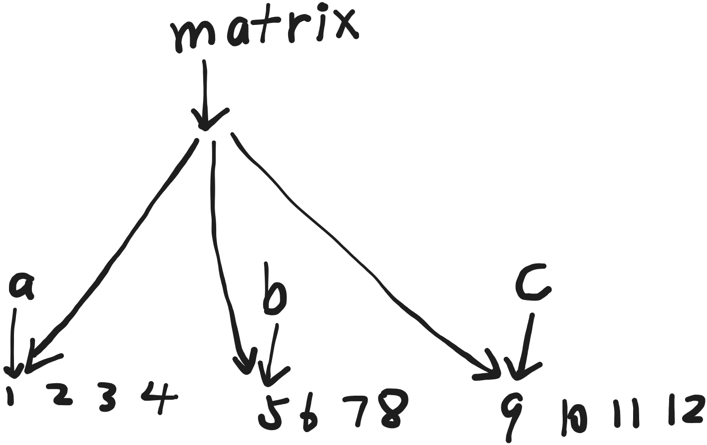
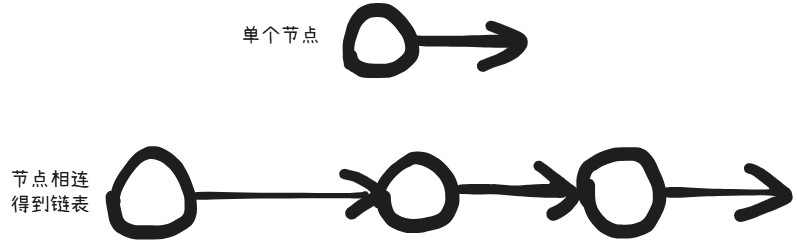

# 计算机必备基础知识

目前在更新 LeetCode 题解，之后可能会整理八股。

## 一、C/C++

### 1. 如何安装

首先安装编译器

第一步，打开 <a href="https://www.msys2.org/" target="_blank">https://www.msys2.org/</a> 下载安装 `msys2-x86_64-xxxx.exe`

第二步，打开 `C:\msys64\ucrt64.exe` 输入命令 `pacman -S --needed base-devel mingw-w64-ucrt-x86_64-toolchain`

第三步，将 `C:\msys64\ucrt64\bin` 添加到环境变量 `Path` 中

然后安装编辑器

第一步，打开 [https://code.visualstudio.com/](https://code.visualstudio.com/) 下载安装

第二步，安装 `Chinese (Simplified) (简体中文) Language Pack for Visual Studio Code` 和 `C/C++` 这两个插件

这样就安装完成了，MSYS2 在这里是用来安装 GCC 编译器的工具，我们写的代码本质上只是一个文本文件，编译器是用来将代码文本转换为 `.exe` 程序的翻译器。之后安装的 VS Code 是一个代码编辑器，本质上也就是编辑代码文本的，里面可以安装各种插件，`C/C++` 插件提供了语法高亮、代码格式化、错误检测等功能。

### 2. Hello, world!

安装完成后可以开始写代码了，新建一个文件，随便起个名字，后缀改为 `.cpp`，例如 `test.cpp`，然后把以下代码复制进去

```cpp title="C++"
#include <iostream>
using namespace std;
int main() {
    cout << "Hello, world!" << endl;
    return 0;
}
```

然后保存文件，打开终端至文件所在文件夹并运行命令 `g++ test.cpp -o hello`，意思是使用 `g++` 编译器，将 `test.cpp` 这个源代码文件，编译并链接成一个名为 `hello.exe` 的可执行程序。编译完成后，输入命令 `.\hello` 就可运行程序。

现在开始逐行解释以上代码，一共有五行

第一行引入了 `<iostream>` 头文件，引入头文件是为了调用该文件里的代码功能，后面用到的 `cout` 就是来自 `<iostream>`

第二行的意思是使用命名空间 `std`，后面的 `cout` 和 `endl` 就属于 `std` 命名空间。如果删掉第二行，不使用命名空间的话，命名空间就会把各种名字（比如变量名、函数名、类名）封存起来，避免和其它地方的同名内容引起冲突，得在前面加上 `std::`，把代码改为 `std::cout << "Hello, world!" << std::endl`，才能使用该命名空间里的工具

第三到五行是主程序，叫做 `main` 函数，程序会逐行执行 `main` 函数里的内容

第四行用了 `cout`，功能是输出数据显示到屏幕上，这里输出的是一个字符串 `"Hello, world!"`，然后用了 `endl`，功能是换行并立即刷新输出缓冲区，也可以用 `\n` 换行，代码改为 `cout << "Hello, world!\n"`，但是不会立即刷新输出缓冲区

第五行是返回一个整数 `0` 给 `main` 函数，在惯例上返回 `0` 代表程序成功执行到最后这行

总之新手写 C++ 直接无脑把以下内容都写上，在 `int main()` 下方 `return 0` 上方写主程序就行

```cpp title="C++"
#include <iostream>
using namespace std;
int main() {

    return 0;
}
```

### 3. 指针与内存分配

C/C++ 常用的数据类型包括整数 `int`，双精度浮点数 `double`，字符 `char` 等，这些数据类型都是以二进制的形式储存在内存里的，一个 `int` 占 4 个字节，一个 `double` 占 8 个字节，一个 `char` 占 1 个字节，所有的数据都是整数个字节倍的大小，计算机通常按字节给数据编址。可以把内存看成是一个字节一个字节的二进制数据按顺序排好，从 0 开始编址，通过地址就能找到数据在内存里的位置，从而读取它。指针就相当于地址，指向了内存里的位置。我们可以手动设置一个指针，指定它的数据类型，然后给它分配内存，这样可以在内存里创建一个数据，还可以通过把分配给该指针的内存设置为单个该数据类型大小的整数倍，创建一个数组。需要注意的是，指针的指向是分配的内存的最开头的那一个点的位置。

接下来将展示如何用指针和内存分配创建数组 `[1,2,...,n]`

```cpp title="C++"
#include <iostream>
using namespace std;

int main() {
    int n;
    cin >> n;
    int *a = new int[n]; // 分配大小为 n 个整数的内存，从而创建一个数组
    for (int i = 0; i < n; i++) {
        a[i] = i + 1;
    }
    for (int i = 0; i < n; i++) {
        cout << a[i] << " ";
    }
    cout << endl;
    delete[] a; // 手动释放掉分配的内存，防止内存泄漏
    return 0;
}
```

接下来将展示如何用指针和内存分配创建如下矩阵

$$
\begin{pmatrix}
1&2&3&4\\
5&6&7&8\\
9&10&11&12\\
\end{pmatrix}
$$

首先把该矩阵拆成三个数组，分别为 `[1,2,3,4],[5,6,7,8],[9,10,11,12]`，分别存到变量 `int *a, *b, *c` 里

然后创建矩阵变量，矩阵变量记为 `int **matrix`，类型是 `int**` 代表 `matrix` 是指针 `int*` 的指针，也就是指针 `int*` 的数组，我们要做的是让 `matrix = [a,b,c]`。例如之后如果要访问矩阵的第 $i$ 行第 $j$ 个元素，就去访问 `matrix` 的第 $i$ 个元素的第 $j$ 个元素即可，示例代码如下

```cpp title="C++"
#include <iostream>
using namespace std;

int main() {
    int *a, *b, *c;
    a = new int[4];
    b = new int[4];
    c = new int[4];
    for (int i = 0; i < 4; i++) {
        a[i] = i + 1;
        b[i] = i + 5;
        c[i] = i + 9;
    }
    int **matrix = new int *[3];
    matrix[0] = a;
    matrix[1] = b;
    matrix[2] = c;
    for (int i = 0; i < 3; i++) {
        for (int j = 0; j < 4; j++) {
            cout << matrix[i][j] << " ";
        }
        cout << endl;
    }
    delete[] a;
    delete[] b;
    delete[] c;
    delete[] matrix;
    return 0;
}
```

下图展示了以上代码的过程



## 二、数据结构

### 1. 链表

在使用数组时，会发现数组创建后是无法改变长度的，下面将介绍链表，实现一个可变长，可在头部、中间以及尾部插入元素，删除元素的可变长的数据结构。

我们在这通过结构体来实现链表，链表通过一个一个的节点连接起来，每一个节点 `ListNode` 包括两个内部元素，一个是该节点自身存储的值 `int val`，另一个是指向下一个节点的指针 `ListNode *next`，如下图所示



我们需要实现四个功能

1. 查找第 `i` 个节点的值 `getValueAt`
2. 修改第 `i` 个节点的值 `setValueAt`
3. 在第 `i` 个位置插入节点 `insertAt`
4. 删除第 `i` 个位置的节点 `eraseAt`

以下是示例代码（为了简洁，该代码存在索引越界等缺陷），节点编号 `index` 从 `1` 开始

```cpp title="C++"
#include <iostream>
using namespace std;

struct ListNode {
    int val;
    ListNode *next;
    ListNode() : val(0), next(nullptr) {}
    ListNode(int x) : val(x), next(nullptr) {}
    ListNode(int x, ListNode *next) : val(x), next(next) {}
};

int getValueAt(ListNode *head, int index) {
    ListNode *cur = head;
    for (int pos = 1; pos < index; ++pos) {
        cur = cur->next;
    }
    return cur->val;
}

void setValueAt(ListNode *head, int index, int newValue) {
    ListNode *cur = head;
    for (int pos = 1; pos < index; ++pos) {
        cur = cur->next;
    }
    cur->val = newValue;
}

void insertAt(ListNode *&head, int index, int value) {
    ListNode dummy(0, head);
    ListNode *cur = &dummy;
    for (int pos = 1; pos < index; ++pos) {
        cur = cur->next;
    }
    ListNode *newNode = new ListNode(value);
    newNode->next = cur->next;
    cur->next = newNode;
    head = dummy.next;
}

void eraseAt(ListNode *&head, int index) {
    ListNode dummy(0, head);
    ListNode *cur = &dummy;
    for (int pos = 1; pos < index; ++pos) {
        cur = cur->next;
    }
    ListNode *toDelete = cur->next;
    cur->next = toDelete->next;
    delete toDelete;
    head = dummy.next;
}

void printList(ListNode *head) {
    ListNode *cur = head;
    while (cur != nullptr) {
        cout << cur->val;
        if (cur->next != nullptr) {
            cout << " -> ";
        }
        cur = cur->next;
    }
    cout << "\n";
}

void clearList(ListNode *&head) {
    while (head != nullptr) {
        ListNode *next = head->next;
        delete head;
        head = next;
    }
}

int main() {
    ListNode *head = nullptr;
    int value;

    // 初始插入: 10 -> 20 -> 30
    insertAt(head, 1, 10);
    insertAt(head, 2, 20);
    insertAt(head, 3, 30);
    cout << "初始链表: ";
    printList(head);

    // 1. 查找第2个节点的值
    value = getValueAt(head, 2);
    cout << "第2个节点的值: " << value << "\n";

    // 2. 修改第2个节点的值为88: 10 -> 88 -> 30
    setValueAt(head, 2, 88);
    cout << "setValueAt(2, 88) 后: ";
    printList(head);

    // 3. 在第2个位置插入99: 10 -> 99 -> 88 -> 30
    insertAt(head, 2, 99);
    cout << "insertAt(2, 99) 后: ";
    printList(head);

    // 4. 删除第3个元素: 10 -> 99 -> 30
    eraseAt(head, 3);
    cout << "eraseAt(3) 后: ";
    printList(head);

    clearList(head);

    return 0;
}
```

### 2. 树

以下代码展示了二叉树的前中后序遍历以及层序遍历

```cpp title="C++"
#include <iostream>
#include <queue>
#include <vector>

using namespace std;

struct TreeNode {
    int val;
    TreeNode *left;
    TreeNode *right;
    TreeNode() : val(0), left(nullptr), right(nullptr) {}
    TreeNode(int x) : val(x), left(nullptr), right(nullptr) {}
    TreeNode(int x, TreeNode *left, TreeNode *right)
        : val(x), left(left), right(right) {}
};

TreeNode *buildSampleTree() {
    // 构建示例二叉树：
    //         10
    //       /    \
	//      5      15
    //     / \    / \
	//    3   7  12  18
    TreeNode *n3 = new TreeNode(3);
    TreeNode *n7 = new TreeNode(7);
    TreeNode *n12 = new TreeNode(12);
    TreeNode *n18 = new TreeNode(18);
    TreeNode *n5 = new TreeNode(5, n3, n7);
    TreeNode *n15 = new TreeNode(15, n12, n18);
    TreeNode *root = new TreeNode(10, n5, n15);
    return root;
}

void preorderTraversal(TreeNode *root, vector<int> &order) {
    if (root == nullptr) {
        return;
    }
    order.push_back(root->val);
    preorderTraversal(root->left, order);
    preorderTraversal(root->right, order);
}

void inorderTraversal(TreeNode *root, vector<int> &order) {
    if (root == nullptr) {
        return;
    }
    inorderTraversal(root->left, order);
    order.push_back(root->val);
    inorderTraversal(root->right, order);
}

void postorderTraversal(TreeNode *root, vector<int> &order) {
    if (root == nullptr) {
        return;
    }
    postorderTraversal(root->left, order);
    postorderTraversal(root->right, order);
    order.push_back(root->val);
}

vector<int> levelOrderTraversal(TreeNode *root) {
    vector<int> order;
    if (root == nullptr) {
        return order;
    }

    queue<TreeNode *> q;
    q.push(root);

    while (!q.empty()) {
        TreeNode *cur = q.front();
        q.pop();
        order.push_back(cur->val);
        if (cur->left != nullptr) {
            q.push(cur->left);
        }
        if (cur->right != nullptr) {
            q.push(cur->right);
        }
    }

    return order;
}

void printOrder(const vector<int> &order) {
    for (size_t i = 0; i < order.size(); ++i) {
        cout << order[i] << " ";
    }
    cout << "\n";
}

void deleteTree(TreeNode *root) {
    if (root == nullptr) {
        return;
    }
    deleteTree(root->left);
    deleteTree(root->right);
    delete root;
}

int main() {
    TreeNode *root = buildSampleTree();

    vector<int> preorder;
    vector<int> inorder;
    vector<int> postorder;

    preorderTraversal(root, preorder);
    inorderTraversal(root, inorder);
    postorderTraversal(root, postorder);
    vector<int> levelorder = levelOrderTraversal(root);

    cout << "前序遍历: ";
    printOrder(preorder);

    cout << "中序遍历: ";
    printOrder(inorder);

    cout << "后序遍历: ";
    printOrder(postorder);

    cout << "层序遍历: ";
    printOrder(levelorder);

    deleteTree(root);
    return 0;
}
```

### 3. 图
