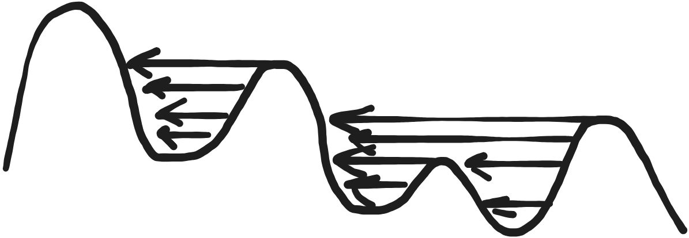
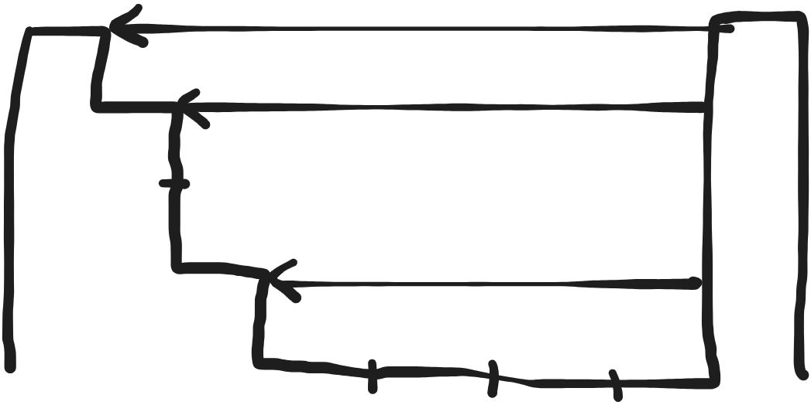

import Tabs from '@theme/Tabs';
import TabItem from '@theme/TabItem';

# 42. 接雨水

[原题链接](https://leetcode.cn/problems/trapping-rain-water/description/?envType=study-plan-v2&envId=top-100-liked)

给定一个数组代表 `n` 个宽度为 `1` 的柱子的高度，计算下雨后能接多少雨水。

### 方法一：动态规划

分别计算每个柱子正上方的雨水量，然后给所有的都加起来。为了计算第 `i` 个柱子正上方的雨水量，我们需要知道它左侧所有柱子的最大高度以及右侧所有柱子的最大高度，可以开两个数组 `int[] leftMax` 和 `int[] rightMax` 存储每个位置左右侧的最大高度。

```java title="Java"
class Solution {
    public int trap(int[] height) {
        int n = height.length;
        int[] leftMax = new int[n];
        int[] rightMax = new int[n];
        leftMax[0] = 0;
        rightMax[n - 1] = 0;
        for (int i = 1; i < n; i++) {
            leftMax[i] = Math.max(leftMax[i - 1], height[i - 1]);
            rightMax[n - i - 1] = Math.max(rightMax[n - i], height[n - i]);
        }
        int ans = 0;
        for (int i = 0; i < n; i++) {
            int water = Math.min(leftMax[i], rightMax[i]) - height[i];
            if (water > 0) ans += water;
        }
        return ans;
    }
}
```

时间复杂度：$O(n)$。

空间复杂度：$O(n)$。

### 方法二：单调栈

维护一个单调栈，单调栈存储的是下标，下标对应的高度单调递减。按顺序遍历数组 `height`，如果递减就入栈，如果不递减，也就是当 `height[i] > height[stack.peek()]` 时，从 `height[i]` 的顶层往左画一条水平线，碰撞到之前的柱子，从而得到一个装水的凹槽，然后计算里面的水量，如下图所示。



为了计算凹槽内的水量，我们需要分层进行计算，下图分为了三层，分层的依据是左侧高度变化的次数，然后分别把这三层的水量算出来再加起来就得到了这个凹槽的水量。首先是最底层，水量为 `4 * 1`，然后是第二层，水量为 `5 * 2`，最后是第三层，水量为 `6 * 1`，于是这个凹槽内的水量为 `4 * 1 + 5 * 2 + 6 * 1 = 20`。



```java title="Java"
class Solution {
    public int trap(int[] height) {
        int ans = 0;
        Deque<Integer> stack = new ArrayDeque<>();
        int n = height.length;
        for (int i = 0; i < n; i++) {
            while (!stack.isEmpty() && height[i] > height[stack.peek()]) {
                int top = stack.pop();
                if (stack.isEmpty()) break;
                int peek = stack.peek();
                int w = i - peek - 1;
                int h = Math.min(height[peek], height[i]) - height[top];
                ans += w * h;
            }
            stack.push(i);
        }
        return ans;
    }
}
```

时间复杂度：$O(n)$。

空间复杂度：$O(n)$。

### 方法三：双指针

<Tabs>
<TabItem value="method1" label="写法一">

类似于方法一，同样考虑 `leftMax` 以及 `rightMax`，但是不设数组，用双指针法优化空间复杂度。每次判断 `if (leftMax < rightMax)` 后，都可以决定较短一个柱子上方的水量。

```java title="Java"
class Solution {
    public int trap(int[] height) {
        int ans = 0;
        int left = 0, right = height.length - 1;
        int leftMax = 0, rightMax = 0;
        while (left <= right) {
            if (leftMax < rightMax) {
                if (leftMax > height[left]) {
                    ans += leftMax - height[left];
                } else {
                    leftMax = height[left];
                }
                left++;
            } else {
                if (rightMax > height[right]) {
                    ans += rightMax - height[right];
                } else {
                    rightMax = height[right];
                }
                right--;
            }
        }
        return ans;
    }
}
```

时间复杂度：$O(n)$。

空间复杂度：$O(1)$。

</TabItem>
<TabItem value="method2" label="写法二">

类似于方法一，同样考虑 `leftMax` 以及 `rightMax`，但是不设数组，用双指针法优化空间复杂度。用 `sideMax` 保存当前柱子 `side` 侧包含当前柱子本身的最大高度。每次判断 `if (height[left] < height[right])` 后，都移动较短的一边，因此 `height[left]` 和 `height[right]` 有一个是当前已遍历的柱子中最高的，因此短的那一个柱子上方的水量可以直接用 `shortsideMax - height[shortside]` 求，而不是 `Math.min(leftMax[i], rightMax[i]) - height[i]`。最外层的 `while (left < right)` 循环也不需要取等，因为当 `left == right` 时，此柱子是全局最高的，上面不会有雨水。

```java title="Java"
class Solution {
    public int trap(int[] height) {
        int ans = 0;
        int left = 0, right = height.length - 1;
        int leftMax = 0, rightMax = 0;
        while (left < right) {
            leftMax = Math.max(leftMax, height[left]);
            rightMax = Math.max(rightMax, height[right]);
            if (height[left] < height[right]) {
                ans += leftMax - height[left++];
            } else {
                ans += rightMax - height[right--];
            }
        }
        return ans;
    }
}
```

时间复杂度：$O(n)$。

空间复杂度：$O(1)$。

</TabItem>
</Tabs>
